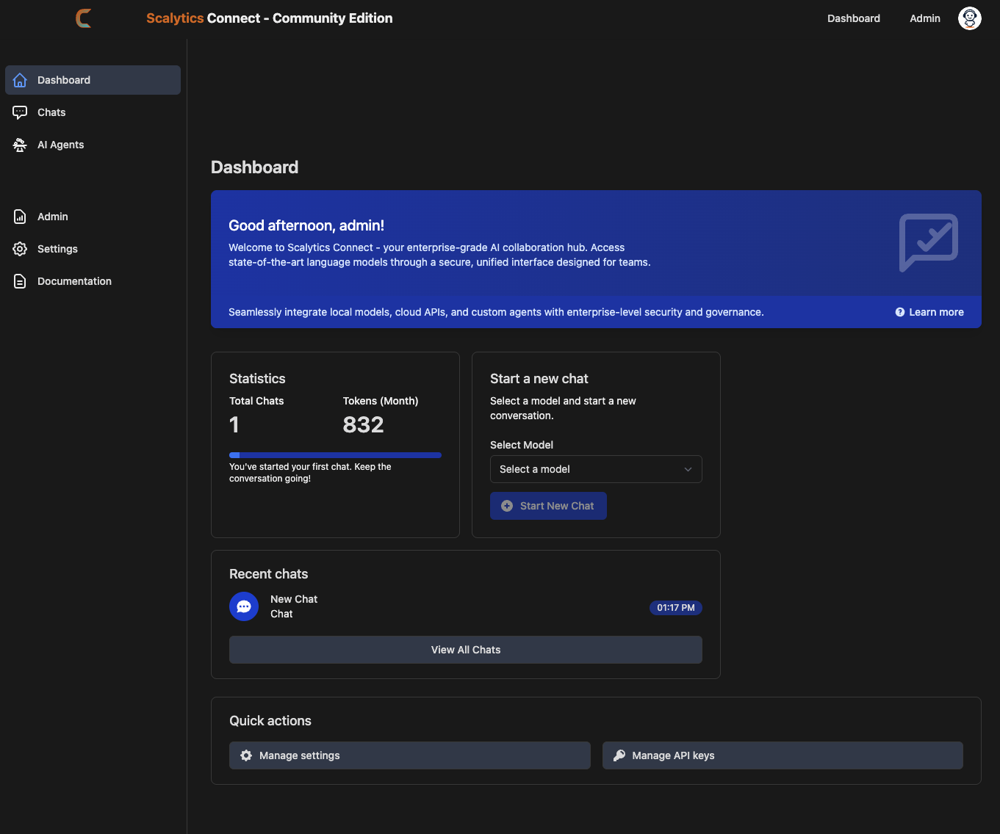
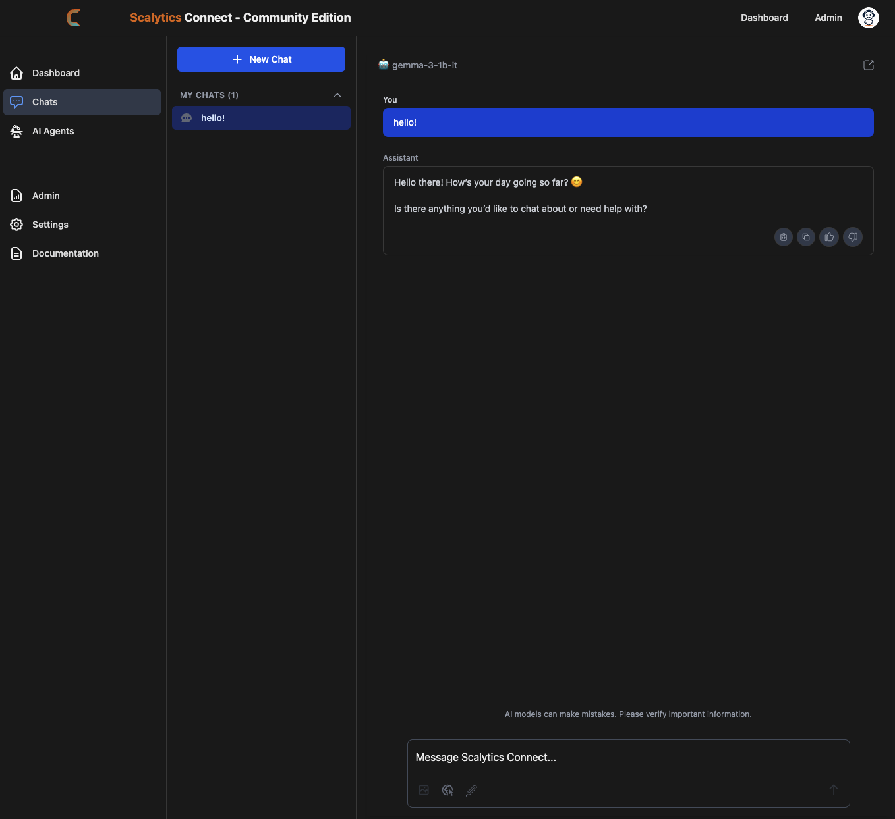
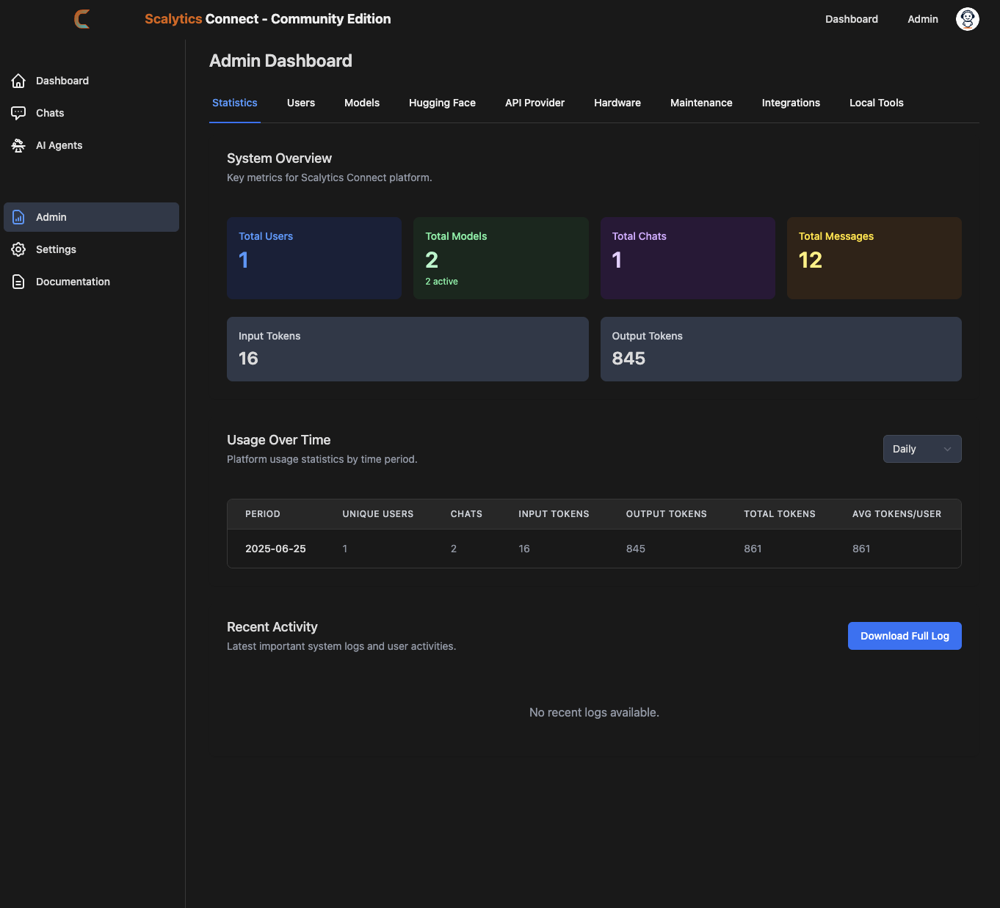
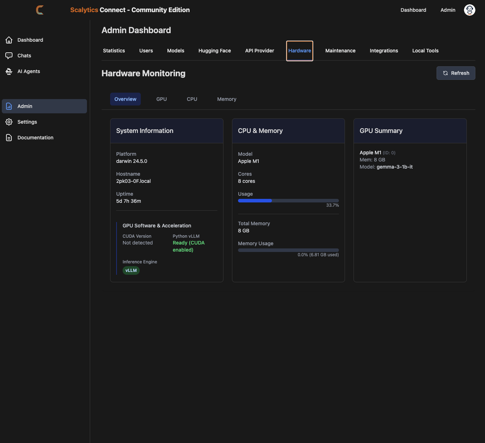

# Scalytics Community Edition

Welcome to the Scalytics Community Edition! This is the open-source version of the Scalytics platform, a powerful tool for AI-driven data analysis and insights.

# Screenshots

<table>
  <tr>
    <td align="center">
      
      <br />
      <sub><b>Dashboard</b></sub>
    </td>
    <td align="center">
      
      <br />
      <sub><b>Chat Interface</b></sub>
    </td>
  </tr>
  <tr>
    <td align="center">
      
      <br />
      <sub><b>Admin Panel</b></sub>
    </td>
    <td align="center">
      
      <br />
      <sub><b>Hardware Monitoring</b></sub>
    </td>
  </tr>
</table>

- GPU advised; works with M* architecture, too
- 16 GB RAM recommended; more is always better
- SSD hard disk, 1TB if 70B models are run

## Getting Started

To get started with the Scalytics Community Edition, follow these steps:

1.  Clone the repository:
    ```bash
    git clone git@github.com:scalytics/Scalytics-Community-Edition.git
    cd Scalytics-Community-Edition
    ```

2.  Set up your environment:
    - Create a `.env` file by copying the example: `cp .env.example .env`
    - Fill in the required environment variables in your new `.env` file.

3.  Run the application:
    ```bash
    ./start-app.sh
    ```

## Initial Setup

After the application starts:

1. Reset the admin password in the shell:
   ```bash
   node scripts/reset_admin_password.js
   ```
2. Copy the password and log in.
3. Download an embedding model and activate it over Models -> Local Models.
4. Download an LLM, activate it over Models -> Local Models Edit -> Set config, Save & Activate.

## Documentation

For more detailed information, please refer to our official documentation in the `docs/` directory.

## API Testing

You can test the API using `curl`.

### List Models

```bash
curl -X GET http://localhost:3001/v1/models -H "Authorization: Bearer YOUR_API_KEY"
```

### Chat Completions (Non-Streaming)

```bash
curl -X POST http://localhost:3001/v1/chat/completions -H "Authorization: Bearer YOUR_API_KEY" -H "Content-Type: application/json" -d '{"messages": [{"role": "user", "content": "Hello"}]}'
```

### Chat Completions (Streaming)

```bash
curl -X POST http://localhost:3001/v1/chat/completions -H "Authorization: Bearer YOUR_API_KEY" -H "Content-Type: application/json" -d '{"messages": [{"role": "user", "content": "Hello"}], "stream": true}'
```

## Contributing

We welcome contributions from the community! Please read our contributing guidelines before submitting a pull request.

## License

This project is licensed under the Apache 2.0 License.
