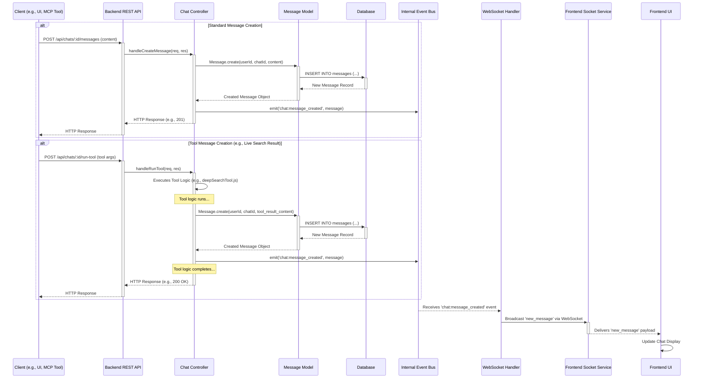

# Developer Guide: Scalytics Connect Messaging Hub

## 1. Overview

This guide explains the core messaging system within Scalytics Connect, focusing on how messages are created, stored, and distributed. Understanding this system is crucial for developers integrating new features or MCP (Model Context Protocol) tools that need to interact with the chat interface.

The key components involved are:

*   **Backend REST API:** Provides endpoints for standard chat interactions (e.g., creating messages).
*   **Database (SQLite):** Persistently stores chat messages and related information.
*   **Internal Event Bus:** A Node.js `EventEmitter` used for decoupling services within the backend. When a significant event occurs (like message creation), it's emitted on the bus.
*   **WebSocket Handler:** Listens to relevant events on the internal event bus and broadcasts updates to connected clients via WebSockets.
*   **Frontend Socket Service:** Manages the WebSocket connection on the client-side and handles incoming messages.

## 2. Core Message Flow

The following diagram illustrates the typical lifecycle of a message, from creation to display:

## 3. Creating Messages

There are two primary ways messages are created in the system:

### a) Via REST API

Standard user messages sent from the UI typically use the following endpoint:

*   **Endpoint:** `POST /api/chats/:chatId/messages`
*   **Authentication:** Requires user authentication (JWT).
*   **Body:** `{ "content": "Your message text here" }`
*   **Process:**
    1.  The `chatController` receives the request.
    2.  It calls `Message.create(userId, chatId, content)`.
    3.  `Message.create` inserts the message into the `messages` table in the database.
    4.  Upon successful insertion, `Message.create` returns the new message object.
    5.  The `chatController` emits a `chat:message_created` event on the internal `eventBus` with the message object as the payload.
    6.  The controller sends an HTTP response (e.g., 201 Created) back to the client.

### b) Via Internal Tool Execution

Backend processes or MCP tools that generate results intended for the chat (like Live Search) create messages directly using the `Message` model:

*   **Method:** `Message.create(userId, chatId, content, [messageType], [metadata])`
*   **Context:** This is typically called from within a service or controller handling the tool's execution (e.g., within `deepSearchTool.js` or the controller that invokes it).
*   **Process:**
    1.  The tool logic generates the content for the message.
    2.  It calls `Message.create()` with the appropriate user ID, chat ID, and the generated content. Optional `messageType` (e.g., 'tool_result') and `metadata` can be included.
    3.  `Message.create` inserts the record into the database.
    4.  Crucially, the code that called `Message.create` **must also ensure** the `chat:message_created` event is emitted on the `eventBus` afterwards, usually via the controller managing the overall flow. This triggers the WebSocket update.

## 4. Receiving Messages (Frontend)

The frontend relies on WebSockets for real-time message updates:

1.  **Connection:** `frontend/src/services/socketService.js` establishes and manages the WebSocket connection.
2.  **Event Listening:** It listens for various events broadcast by the backend's `socketHandlers.js`.
3.  **`new_message` Event:** When the backend `socketHandlers.js` receives a `chat:message_created` event from the internal `eventBus`, it broadcasts a `new_message` event over the WebSocket to connected clients for that chat.
4.  **State Update:** `socketService.js` receives the `new_message` event and typically updates the application state (e.g., via context or hooks like `useChatMessages.js`), causing the UI (`ChatContent.jsx`, `ChatBubble.jsx`, etc.) to re-render and display the new message.

## 5. Integrating MCP Tools

When developing an MCP tool that needs to post results or updates to the chat:

*   **Use `Message.create()`:** The tool's backend logic (likely running within a Node.js service invoked by the MCP framework) should use the `Message.create()` model method to save its output as a message associated with the correct `chatId` and `userId`.
*   **Emit `chat:message_created`:** Ensure the controller or service managing the tool's execution flow emits the `chat:message_created` event on the internal `eventBus` after the message is successfully saved to the database. This is essential for the UI to update in real-time.
*   **Consider Message Types:** Use the optional `messageType` parameter in `Message.create()` (e.g., `'tool_update'`, `'tool_final_result'`) to differentiate tool messages from regular user/assistant messages if needed for specific UI rendering.
*   **Streaming:** For tools that generate output incrementally (like Live Search), consider using the dedicated tool streaming mechanism (`tool_stream_started`, `tool_stream_chunk`, etc.) managed by `streamingManager.js` on the frontend, rather than creating many small messages. Final results, however, should still typically be saved via `Message.create()`.

## 6. Key Events

*   **Internal Event Bus (`eventBus`):**
    *   `chat:message_created`: Fired after a message is saved to the DB. Payload: message object.
    *   `chat:title_updated`: Fired when a chat's title changes. Payload: { chatId, newTitle }.
    *   *(Potentially others related to chat state)*
*   **WebSocket Events (Server -> Client):**
    *   `new_message`: Sent when a new message should be displayed. Payload: message object.
    *   `chat_title_updated`: Sent when a chat title changes. Payload: { chatId, newTitle }.
    *   `tool_stream_started`, `tool_stream_chunk`, `tool_stream_complete`, `tool_stream_error`: Used for streaming tool output.

## 7. Considerations

*   **Error Handling:** Ensure robust error handling around `Message.create()` calls and event emissions.
*   **Consistency:** Maintain consistency in message structure and event payloads.
*   **Security:** Database interactions and event emissions should occur within authenticated and authorized contexts.
