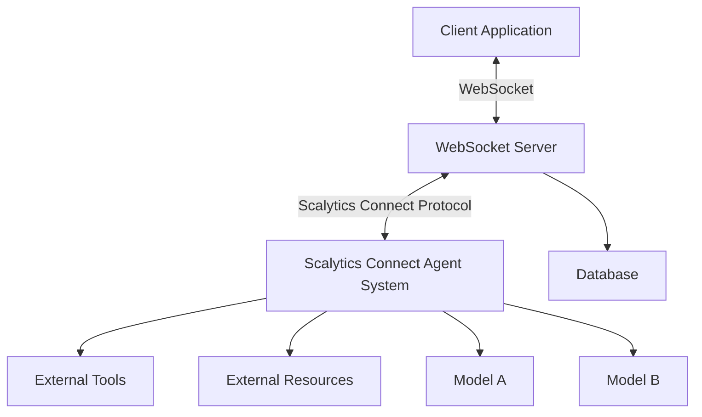
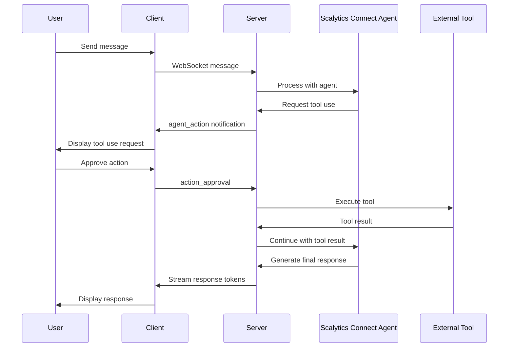
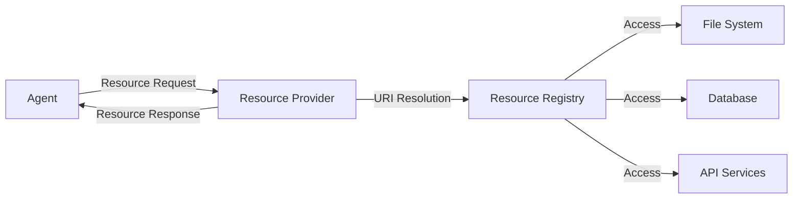
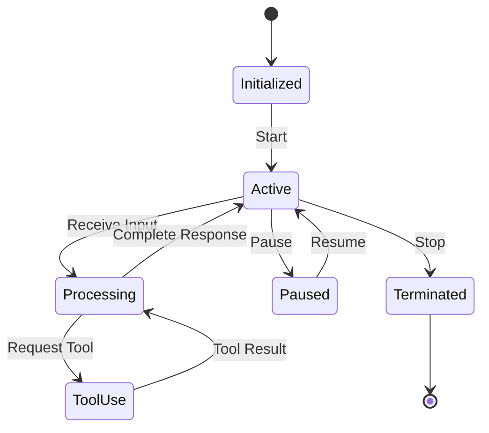

# Scalytics Connect Agent System

## Overview

The Scalytics Connect Agent System enables powerful AI agents to interact with external tools and resources through a WebSocket-based communication protocol. This document describes the architecture, implementation, and usage of the Scalytics Connect Agent System.

## Architecture

The Scalytics Connect Agent System integrates with the existing infrastructure through a WebSocket interface, providing real-time bidirectional communication between clients and AI agents.



### Components

1. **WebSocket Server**: Handles persistent connections, authentication, and message routing
2. **Scalytics Connect Agent Interface**: Facilitates bidirectional communication with AI agents
3. **Tool Registry**: Manages available tools and their capabilities
4. **Resource Provider**: Supplies context and data to agents
5. **Agent Manager**: Handles agent lifecycle and state

## Scalytics Connect Communication Protocol

The Scalytics Connect protocol is implemented as a specialized set of WebSocket messages:



### Message Protocol

The Scalytics Connect system uses a structured JSON message format for all communications:

```json
{
  "type": "message_type",
  "id": "unique_message_id",
  "payload": {
    // Message-specific data
  }
}
```

#### Message Types

| Type | Direction | Purpose |
|------|-----------|---------|
| `agent_action` | Server → Client | Scalytics Connect agent performing an action |
| `agent_result` | Client → Server | Result of agent action |
| `tool_list` | Bidirectional | Available tools information |
| `resource_request` | Agent → Server | Agent requesting a resource |
| `resource_response` | Server → Agent | Resource data for agent |

## Tool Integration

Tools are integrated through standardized interfaces:

```javascript
class ScalyticsConnectTool {
  // Tool definition
  getDefinition() {
    return {
      name: "tool_name",
      description: "Tool description",
      parameters: {...} // JSON schema
    };
  }
  
  // Tool execution
  async execute(parameters) {
    // Implementation
    return result;
  }
}
```

### Tool Definition Example

```json
{
  "name": "web_search",
  "description": "Search the web for information",
  "parameters": {
    "type": "object",
    "properties": {
      "query": {
        "type": "string",
        "description": "The search query"
      },
      "num_results": {
        "type": "integer",
        "description": "Number of results to return",
        "default": 5
      }
    },
    "required": ["query"]
  }
}
```

## Resource Access

Resources represent data sources that can be accessed by agents:



### Resource URI Format

Resources are identified by URIs following this pattern:
```
[protocol]://[host]/[path]
```

Examples:
- `file://local/documents/report.pdf`
- `db://users/profile/42`
- `api://weather/current/san-francisco`

## Agent Lifecycle



## Security Model

The Scalytics Connect Agent System implements a multi-layered security approach:

1. **Authentication**: All connections require JWT authentication
2. **Authorization**: Granular permissions for tool access
3. **Sandboxing**: Agents operate in restricted environments
4. **Tool Approval**: User approval for sensitive operations
5. **Audit Logging**: Comprehensive logging of all agent actions

### Tool Permission Levels

| Level | Description | Example |
|-------|-------------|---------|
| 0 | No approval needed | Get current time |
| 1 | User approval needed | Web search |
| 2 | Admin approval needed | File system access |
| 3 | System restricted | Payment processing |

## Implementing Custom Agents

Custom agents can be created by extending the base Agent class:

```javascript
class CustomAgent extends BaseAgent {
  constructor(config) {
    super(config);
    this.specialCapability = config.specialCapability;
  }
  
  async processMessage(message) {
    // Custom processing logic
    return response;
  }
  
  async requestToolUse(toolName, parameters) {
    // Custom tool handling
    return result;
  }
}
```

## WebSocket Integration

The Scalytics Connect Agent System connects to clients through the WebSocket server:

```javascript
// Server-side websocket handler
wss.on('connection', (ws) => {
  // Authentication
  ws.on('message', (message) => {
    const parsedMessage = JSON.parse(message);
    
    if (parsedMessage.type === 'agent_connect') {
      // Initialize agent
      const agent = agentManager.createAgent(parsedMessage.agentType);
      sessions.set(ws, { agent });
    }
    else if (parsedMessage.type === 'user_message') {
      const session = sessions.get(ws);
      // Process message with agent
      session.agent.processMessage(parsedMessage.content)
        .then(response => {
          ws.send(JSON.stringify({
            type: 'agent_response',
            content: response
          }));
        });
    }
  });
});
```

## Future Enhancements

1. **Agent Memory**: Persistent memory across sessions
2. **Multi-agent Collaboration**: Agents working together on complex tasks
3. **Learning from Feedback**: Improving agent performance based on user feedback
4. **Advanced Tool Composition**: Allowing agents to chain tools for complex operations
5. **Cross-agent Communication**: Enabling agents to communicate with each other
